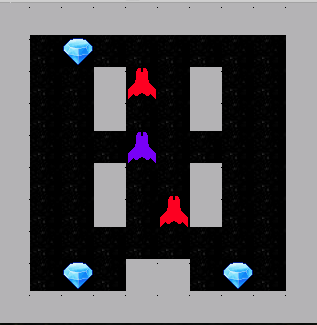
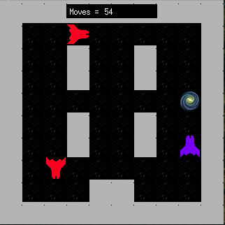

# So Long

## Résumé

Ce projet est un jeu 2D simple conçu pour vous faire utiliser des textures, des sprites et quelques
éléments basiques de gameplay.

## Table des matières

- [So Long](#so-long)
	- [Résumé](#résumé)
	- [Table des matières](#table-des-matières)
	- [Introduction](#introduction)
	- [Partie obligatoire](#partie-obligatoire)
		- [Description](#description)
		- [Règles du jeu](#règles-du-jeu)
		- [Gestion graphique](#gestion-graphique)
		- [La carte](#la-carte)
	- [Partie bonus](#partie-bonus)
	- [Exemples](#exemples)
	- [Essayer le jeu](#essayer-le-jeu)
		- [Compilation](#compilation)
		- [Lancer le jeu](#lancer-le-jeu)
		- [Contrôles](#contrôles)

## Introduction

Être dev, c'est super pour créer son propre jeu. Cependant, un bon jeu nécessite de bonnes
ressources. Afin de créer des jeux 2D, vous devrez rechercher des tiles, tilesets, des sprites et
des sprite sheets.

Fort heureusement, des artistes de talent partagent leur travail sur des plateformes telles que :
[itch.io](https://itch.io). Bien entendu, veuillez respecter le travail d'autrui.

## Partie obligatoire

### Description

Vous devez créer un jeu 2D basique dans lequel un dauphin s'échappe de la planète Terre après avoir
mangé du poisson. Vous pouvez utiliser le personnage, les items et le décor de votre choix.

### Règles du jeu

- Le but du joueur est de collecter tous les items présents sur la carte, puis de s'échapper en
  empruntant le chemin le plus court possible.
- Les touches W, A, S et D doivent être utilisées afin de mouvoir le personnage principal.
- Le joueur doit être capable de se déplacer dans ces 4 directions : haut, bas, gauche, droite.
- Le joueur ne doit pas pouvoir se déplacer dans les murs.
- À chaque mouvement, le compte total de mouvement doit être affiché dans le shell.
- Vous devez utiliser une vue 2D (vue de haut ou de profil).

### Gestion graphique

- Votre programme doit afficher une image dans une fenêtre.
- La gestion de la fenêtre doit rester fluide.
- Appuyer sur la touche ESC doit fermer la fenêtre et quitter le programme proprement.
- Utiliser les images de la MiniLibX est obligatoire.

### La carte

- La carte sera construite en utilisant 3 éléments : les murs, les items à collecter, et l'espace
  vide.
- Exemple de carte basique :

```
1171111111111
1001000000001
1000011111001
1P0011E000001
```

- La carte doit contenir 1 sortie, au moins 1 item et 1 position de départ.
- La carte doit être de forme rectangulaire et fermée en étant encadrée par des murs.

## Partie bonus

Vous aurez des points supplémentaires si :

- Le joueur peut perdre si son personnage est touché par une patrouille ennemie.
- Vous ajoutez des sprite animations.
- Le compte total de mouvement est directement affiché sur l'écran dans la fenêtre plutôt que dans
  le shell.

## Exemples

start 

fin de partie 

## Essayer le jeu

### Compilation

1. Clonez ce dépôt sur votre machine locale.
2. Naviguez jusqu'au répertoire du projet.
3. Exécutez la commande `make` pour compiler le projet.

```bash
git clone <repository-url>
cd so_long
make
```

### Lancer le jeu

Une fois la compilation terminée, vous pouvez lancer le jeu en utilisant la commande suivante :

```
./so_long <map-file.ber>
```

Remplacez <map-file.ber> par le chemin vers un fichier de carte valide au format .ber.

### Contrôles

Utilisez les touches W, A, S, D ou les flèches pour déplacer le personnage. Appuyez sur ESC pour
quitter le jeu.

Amusez-vous bien !
